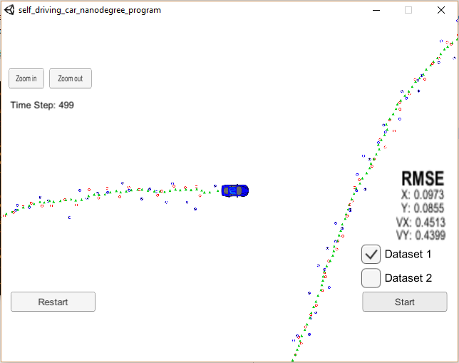

# Extended Kalman Filter Project

## Overview
This repository contains the work I did within **Project #6 of Udacity's Self-Driving Car Nanodegree Program** (first project of second term). Objective of the project is to utilize an extended kalman filter (EKF) to estimate the state (position / velocity) of a moving object of interest (for instance, bicycle in the vicinity of a car) with noisy lidar and radar measurements. 

For this Udacity provides us with a car driving simulator it has developed. It can be downloaded [here](https://github.com/udacity/self-driving-car-sim/releases).

## Repository content

The repository includes the following files:

 - source code in the */src* folder
	 - main.cpp : communicates with the Simulator receiving data measurements, calls a function to run the Kalman filter, calls a function to calculate RMSE
	 - FusionEKF.h & .cpp:  initializes the filter, calls the predict function, calls the update function
 	 - kalman_filter.h & .cpp: defines the predict function, the update function for lidar, and the update function for radar
 	 - tools.h & .cpp: function to calculate RMSE,  radar measurement function and its Jacobian
 	 - measurement_package.h: defines a class to be used to store measurements
 	 - json.hpp: JSON is used for communication with simulator
 - /data: a folder containing a data file for testing the extended Kalman filter which the simulator interface provides. It contains radar / lidar measurements and true vehicle state (2D-position and 2D-velocity). There are 500 measurements (lidar and radar measurements alternatively). Timestep is 50 ms.
 - CMakeLists.txt: file that is used for compiling code

[Here](https://discussions.udacity.com/t/getting-started-with-docker-and-windows-for-the-ekf-project-a-guide/320236]) is a link which details how to have the simulator and code run with Docker on Windows.

## Results

The figure below represents the simulator. The car represents the true position of the tracked object. Lidar measurements are represented by red circles, radar measurements by blue circles with an arrow pointing in the direction of the observed angle, and EKF position estimation by green triangles. We can see that EKF makes a good job in filtering radar and lidar measurements.

On the right and side of the simulator, values of RMSE (root mean square error) for position (x,y) and velocity (vx,vy) are displayed. Here they are the results of processing both radar and lidar measurements. 
I also compared the performance of the EKF with radar only and  lidar only measurements. Final RMSE are given in the table below:

|Type / RMSE|Px|Py |Vx |Vy|
|:--------:|:----:|:----:|:----: |:----: |
|Radar only|0.23|0.34|0.58|0.80|
|Lidar only|0.14|0.12|0.63|0.53|
|Radar+Lidar|0.09|0.09|0.45|0.43|

Performance of Lidar-only is better than that of Radar-only, especially for position measurement. This is not surprising as lidar measurements are far less noisy than radar measurements.
Combining both radar and lidar enables to significantly increase final accuracy.

